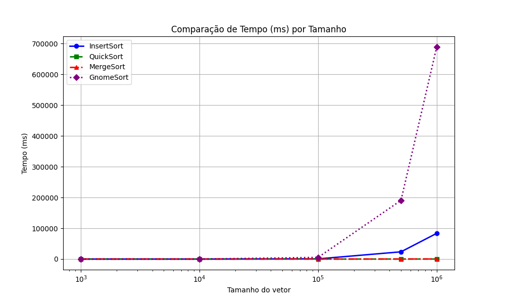
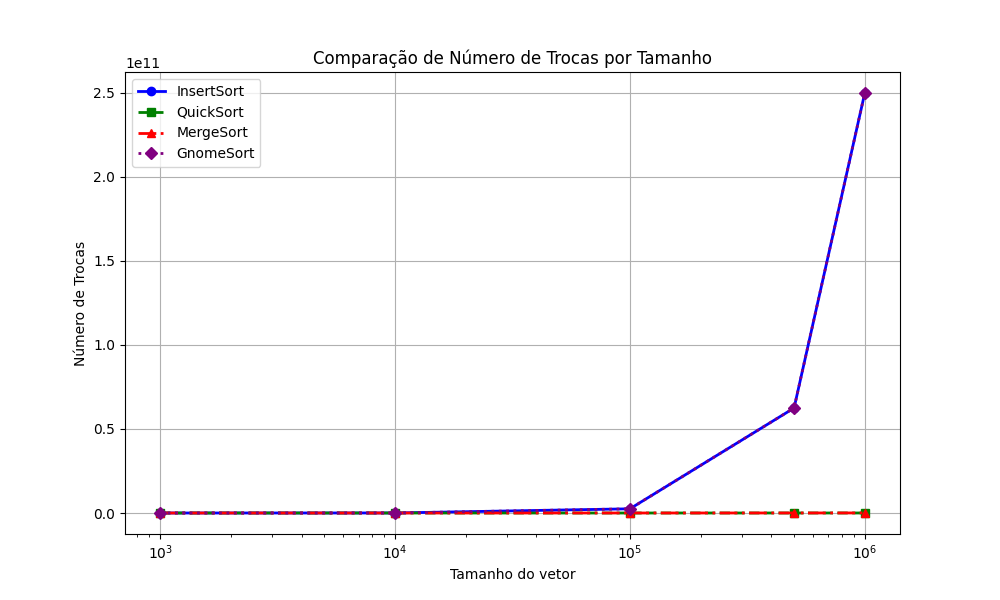
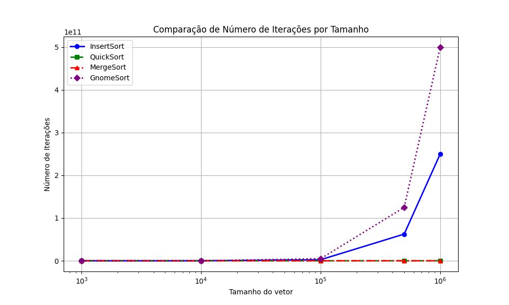

# Análise Comparativa de Algoritmos de Ordenação

Este projeto tem como objetivo realizar uma análise comparativa de desempenho entre quatro algoritmos de ordenação: **Insert Sort**, **Quick Sort**, **Merge Sort** e **Gnome Sort**.

## Algoritmos Analisados

- **Insert Sort**: Algoritmo simples e eficiente para listas pequenas. Percorre o vetor da esquerda para a direita, inserindo cada elemento na posição correta do subvetor ordenado à esquerda.

- **Quick Sort**: Algoritmo eficiente baseado no paradigma de divisão e conquista. Escolhe um pivô e organiza os elementos menores à esquerda e os maiores à direita, aplicando-se recursivamente às subpartições.

- **Merge Sort**: Também baseado em divisão e conquista. Divide o vetor em partes menores, ordena recursivamente e, em seguida, mescla os resultados de forma ordenada.

- **Gnome Sort**: Similar ao Insert Sort, mas com uma abordagem de "avanço e recuo": compara elementos adjacentes e troca se necessário, recuando sempre que um elemento estiver fora de ordem.

## Objetivo

Comparar o desempenho dos algoritmos com base em três métricas principais:

- Tempo de execução (em milissegundos)
- Número de trocas realizadas
- Número de iterações ou comparações efetuadas

## Metodologia

Para garantir uma análise justa e abrangente:

- Foram utilizados vetores de tamanhos variados: `1000`, `10000`, `100000`, `500000`, `1000000`.
- Cada experimento foi executado com 5 seeds diferentes: `42`, `99`, `123`, `2024`, `777`.
- Os dados gerados foram salvos em um arquivo `resultados.csv`.
- Um script em Python foi utilizado para processar esses dados e gerar os gráficos comparativos.

## Gráficos Gerados

### Comparação do Tempo de Execução

Este gráfico compara o tempo médio de execução dos algoritmos para diferentes tamanhos de vetor.

**Análise**:
- Insert Sort e Gnome Sort apresentaram crescimento exponencial no tempo conforme o vetor aumenta, evidenciando baixa escalabilidade.
- Quick Sort foi o mais rápido na maioria dos testes, com excelente desempenho mesmo em vetores grandes.
- Merge Sort também manteve boa performance, com leve aumento no tempo em vetores maiores, mas ainda eficiente.

### Comparação do Número de Trocas

Este gráfico mostra a média de trocas de elementos realizadas por cada algoritmo.

**Análise**:
- Gnome Sort teve o maior número de trocas, com valores extremamente altos.
- Insert Sort também apresentou muitas trocas, embora em menor escala.
- Quick Sort e Merge Sort se destacaram com número de trocas muito reduzido, mostrando-se ideais para contextos com custo alto de movimentação de dados.

### Comparação do Número de Iterações

Este gráfico apresenta a média de iterações (comparações) realizadas por cada algoritmo.

**Análise**:
- Gnome Sort novamente lidera como o mais ineficiente, com crescimento exagerado nas iterações.
- Insert Sort também teve alta contagem de iterações.
- Merge Sort manteve uma taxa estável e eficiente.
- Quick Sort teve desempenho consistente, com variações de acordo com o tipo e a ordem dos dados, mas geralmente eficiente.

## Conclusão

A análise revelou diferenças significativas de desempenho entre os algoritmos:

- Quick Sort se destacou como o mais eficiente em tempo de execução, mantendo baixo número de trocas e iterações, sendo ideal para aplicações com grandes volumes de dados.

- Merge Sort teve desempenho consistente e previsível, sendo uma boa alternativa, especialmente quando a estabilidade na ordenação é necessária.

- Insert Sort e Gnome Sort mostraram-se ineficientes para grandes volumes, devido ao alto número de trocas e comparações. São úteis apenas em listas pequenas ou fins didáticos.

Em resumo, para aplicações práticas, Quick Sort e Merge Sort são as melhores escolhas. A seleção do algoritmo deve considerar o tamanho dos dados, a necessidade de estabilidade e o custo de movimentação.
