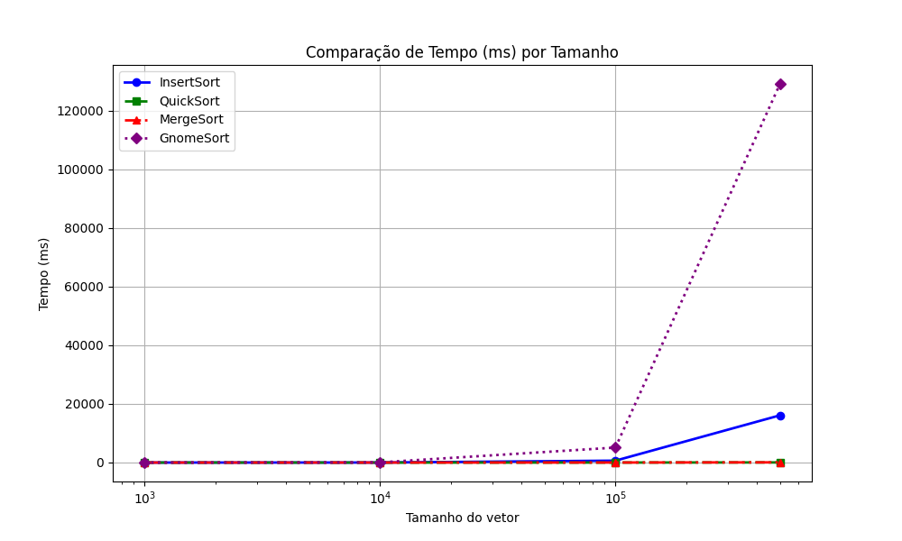
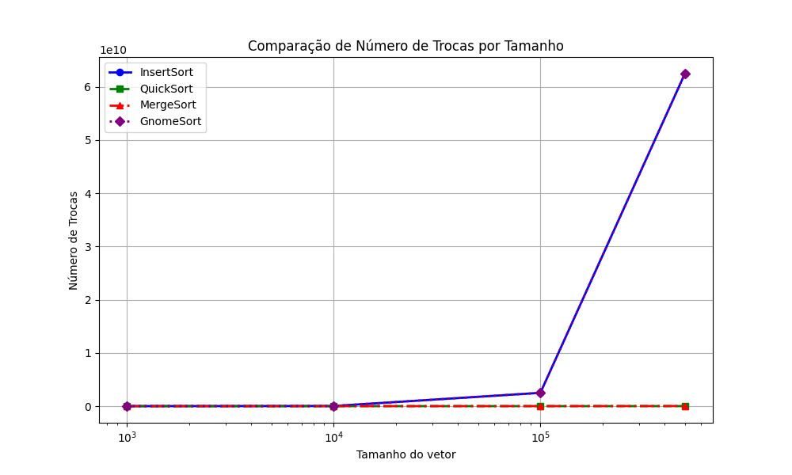
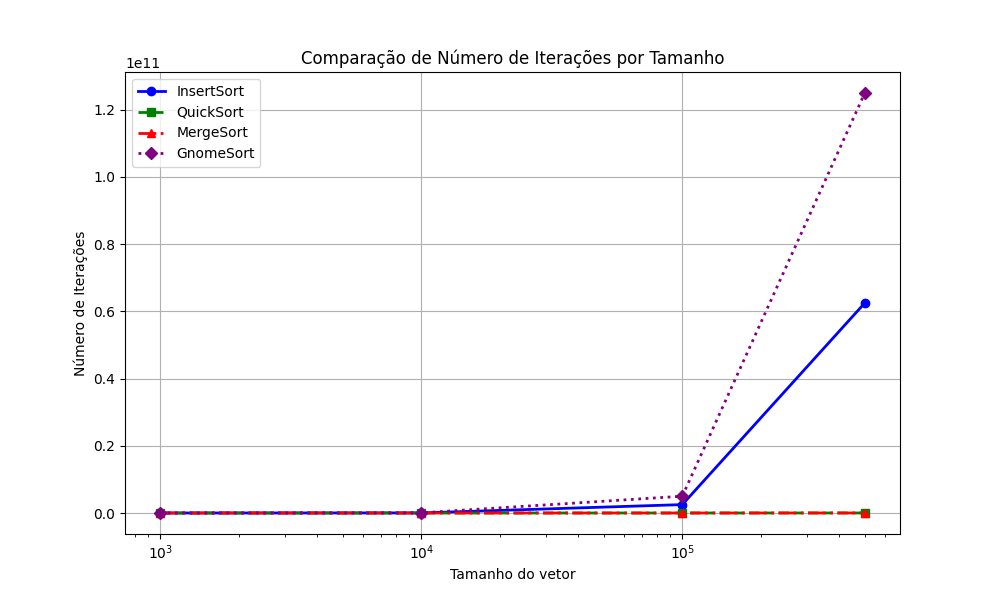

# Análise Comparativa de Algoritmos de Ordenação

Este projeto tem como objetivo realizar uma análise comparativa de desempenho entre quatro algoritmos de ordenação: **Insert Sort**, **Quick Sort**, **Merge Sort** e **Gnome Sort**.

## Algoritmos Analisados

- **Insert Sort**: Algoritmo simples e eficiente para listas pequenas. Ele percorre o vetor da esquerda para a direita, inserindo cada elemento na posição correta do subvetor ordenado à esquerda.
- **Quick Sort**: Algoritmo eficiente baseado no paradigma de divisão e conquista. Escolhe um pivô e organiza os elementos menores à esquerda e os maiores à direita, aplicando recursivamente nas subpartições.
- **Merge Sort**: Outro algoritmo baseado em divisão e conquista. Divide o vetor em partes menores, ordena cada uma recursivamente e depois mescla os resultados de forma ordenada.
- **Gnome Sort**: Similar ao Insert Sort, mas com uma abordagem de "avanço e recuo": o algoritmo compara elementos adjacentes e troca se estiverem fora de ordem, recuando se necessário.

## Objetivo

O principal objetivo é comparar o desempenho dos algoritmos com base em três métricas:
- **Tempo de execução (em milissegundos)**
- **Número de trocas realizadas**
- **Número de iterações ou comparações efetuadas**

## Metodologia

Para uma avaliação justa e detalhada:
- Foram utilizados vetores de tamanhos variados: `1000`, `10000`, `100000`, `500000`.
- Cada experimento foi repetido com 5 sementes diferentes: `42`, `99`, `123`, `2024`, `777`.
- Os dados foram salvos em um arquivo `resultados.csv` para posterior análise.

Um script em Python foi usado para ler o arquivo CSV e gerar os gráficos de comparação.

## Gráficos Gerados

### Comparação do Tempo de Execução

Este gráfico compara o tempo de execução médio dos algoritmos para diferentes tamanhos de entrada.

**Análise**:
- O **Insert Sort** e o **Gnome Sort** apresentaram um crescimento exponencial no tempo de execução à medida que o tamanho do vetor aumentou, evidenciando a ineficiência para grandes volumes de dados.
- O **Quick Sort** foi o mais rápido na maioria dos cenários, com tempos quase constantes mesmo em grandes conjuntos.
- O **Merge Sort** também manteve boa performance, sendo ligeiramente mais lento que o Quick Sort.

---

### Comparação do Número de Trocas

Este gráfico mostra a média de trocas de elementos realizadas por cada algoritmo.

**Análise**:
- O **Gnome Sort** realizou disparadamente o maior número de trocas, confirmando sua baixa eficiência em termos de movimentação de dados.
- O **Insert Sort** também apresentou um número elevado de trocas, ainda que inferior ao Gnome Sort.
- **Quick Sort** e **Merge Sort** foram muito mais econômicos nas trocas, reforçando sua adequação para grandes volumes de dados.

---

### Comparação do Número de Iterações

Este gráfico apresenta a média de iterações ou comparações feitas por cada algoritmo.

**Análise**:
- O **Gnome Sort** novamente lidera como o mais ineficiente, com um número de iterações que cresce rapidamente com o tamanho da entrada.
- O **Insert Sort** também possui muitas iterações, mas ainda fica abaixo do Gnome Sort.
- O **Merge Sort** mantém um número de iterações estável, enquanto o **Quick Sort** varia dependendo do tipo de dado, mas geralmente se mantém eficiente.

---

## Conclusão

A partir da análise dos dados:

- **Quick Sort** demonstrou ser o algoritmo mais eficiente no geral, com baixo tempo de execução e número razoável de comparações e trocas.
- **Merge Sort** teve desempenho estável e competitivo, principalmente em entradas maiores.
- **Insert Sort** e **Gnome Sort** são adequados apenas para listas pequenas, sendo pouco escaláveis e altamente custosos em termos de trocas e tempo.

Os experimentos demonstram que a escolha do algoritmo de ordenação deve ser orientada pelo tamanho da entrada e pelo custo computacional tolerável para a aplicação.
